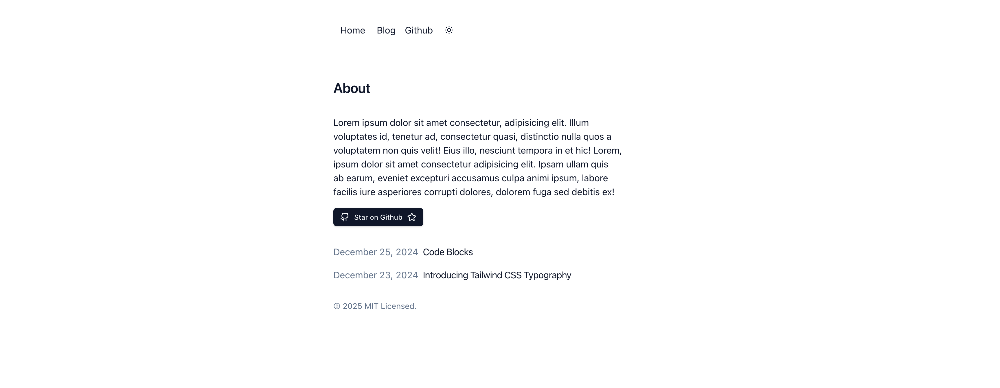

# TSS Blog Starter 🏝️

A blog/portfolio starter project built with TanStack Start.



## Demo

https://tss-blog-starter.pages.dev/

## Features

- MDX and Markdown support
- Syntax highlighting
- Light/dark mode toggle
- Tailwind CSS
- Custom font
- Dynamic OG images (coming soon)
- Font optimisation (coming soon)

## Tech

- [TanStack Start](https://tanstack.com/router/latest/docs/framework/react/guide/tanstack-start#tanstack-start)
- [Tailwind CSS](https://tailwindcss.com)
- [shadcn/ui](https://ui.shadcn.com/)
- [Content Collections](https://www.content-collections.dev/)

## Getting Started

There are two ways of initializing the `tss-blog-starter` app. You can either use this repository as a template or manually clone the app.

### Template

[Use this template](https://github.com/new?template_name=tss-blog-starter&template_owner=ally-ahmed)

### Manually

Clone project

```bash
  git clone git@github.com:ally-ahmed/tss-blog-starter.git
  cd tss-blog-starter
```

Install depndencies

```bash
pnpm install
```

Run app

```bash
pnpm dev
```

## Deployment

Currently using cloudflare as the deployment target in `tss-blog-starter`. To deploy to other targets see [TanStack Start docs on deployment](https://tanstack.com/router/latest/docs/framework/react/start/hosting#deployment).

## Roadmap

- [ ] ES Lint & Prettier
- [ ] Finish up `On this page` component
- [ ] Maybe mobile nav using magic ui dock component
- [ ] Dynamic OG image generation
- [ ] Font optimisation - font change causing Cumulative Layout Shift (CLS)
- [ ] Image optimisation

## Acknowledgements

- [UI inspired by Vercel portfolio blog starter](https://vercel.com/templates/next.js/portfolio-starter-kit)
- [Orc Dev screen size component](https://www.orcdev.com/components/screen-size)
- [shadcn-ui/taxonomy](https://github.com/shadcn-ui/taxonomy/tree/651f984e52edd65d40ccd55e299c1baeea3ff017)
